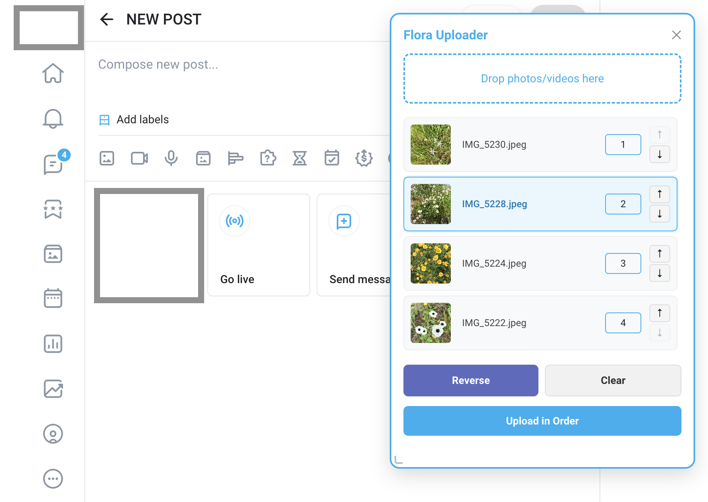

# Flora OF Uploader

Chrome extension for batch uploading photos and videos to OnlyFans in a custom order.

## Features

- **Drag & drop** — drop any number of photos or videos onto the panel
- **Custom order** — set the upload order for each file manually by typing a number
- **Arrow buttons** — move files up or down one position at a time using ↑↓ buttons on each row
- **Keyboard navigation** — click a filename to select it, then use **Arrow Up / Arrow Down** keys to reorder
- **Reverse** — reverse the current order of the entire queue in one click
- **Clear** — remove all files from the queue
- **Resizable panel** — drag the bottom-right corner to resize; file previews scale with the panel width
- **Image previews** — thumbnails shown for standard image formats; HEIC/HEIF and video files show a type label instead

## Supported file types

- Images: JPEG, PNG, WebP, GIF, and other browser-supported formats
- Videos: MP4, MOV, and other browser-supported formats
- HEIC / HEIF (no thumbnail preview, uploaded as-is)

## Installation

1. Clone or download this repository
2. Open Chrome and go to `chrome://extensions`
3. Enable **Developer mode** (top right toggle)
4. Click **Load unpacked** and select the project folder

## Usage

1. On OnlyFans, open the **New Post** page (`/posts/create`)
2. Click the extension icon in the Chrome toolbar to open the uploader panel
3. Drag and drop files onto the drop zone
4. Arrange files in the desired order:
   - Type a number in the order field next to a file
   - Click the ↑ or ↓ buttons to move a file one step
   - Click a filename to select it, then press **↑ / ↓** on the keyboard
   - Use **Reverse** to flip the entire queue
5. Click **Upload in Order** — files are submitted to OnlyFans in the specified order

> If the upload field is not visible yet, the extension will automatically click the camera button and wait for it to appear.

## Files

| File | Purpose |
|---|---|
| `manifest.json` | Extension configuration (Manifest V3) |
| `background.js` | Service worker — listens for toolbar icon clicks |
| `content.js` | Main logic: panel UI, queue management, upload |
| `style.css` | Panel styles |
